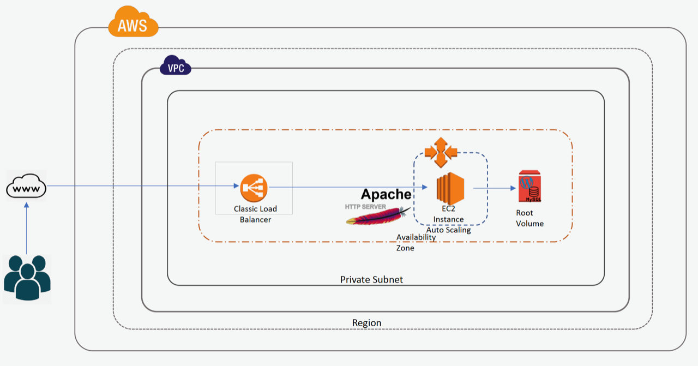

# Wordpress Infrastructure

##Description:
* This is the infrastructure for Wordpress with high available and scalable platform.

##Architecture:

### Follwing resource are created using cloudformation template.
- VPC
- Internet Gateway
- RouteTable
- Route
- VPC Gateway Attachment
- Subnet
- Subnet Route Table Association
- Security Group
- Launch Configuration
- AutoScaling Group
- Load Balancer
